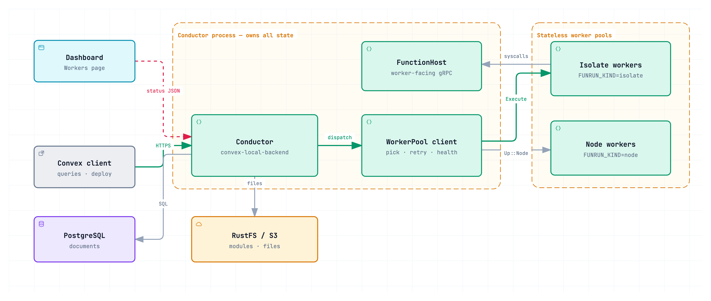
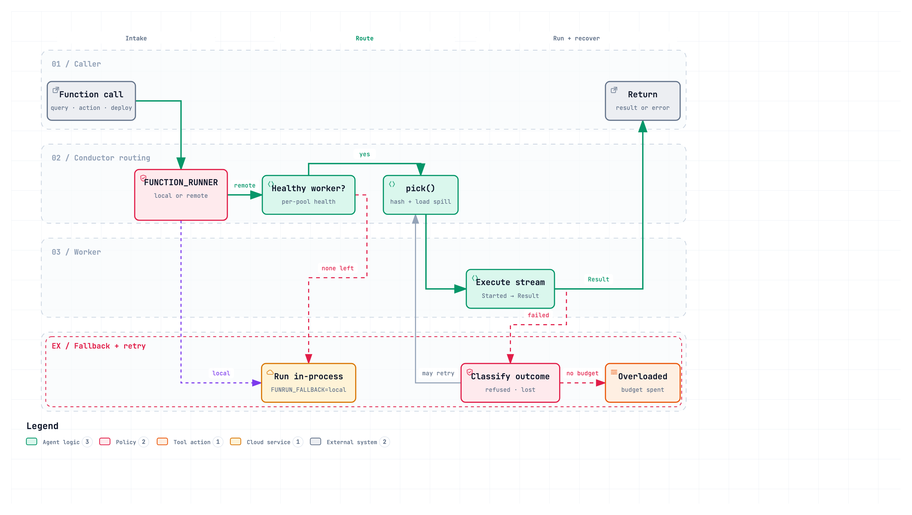
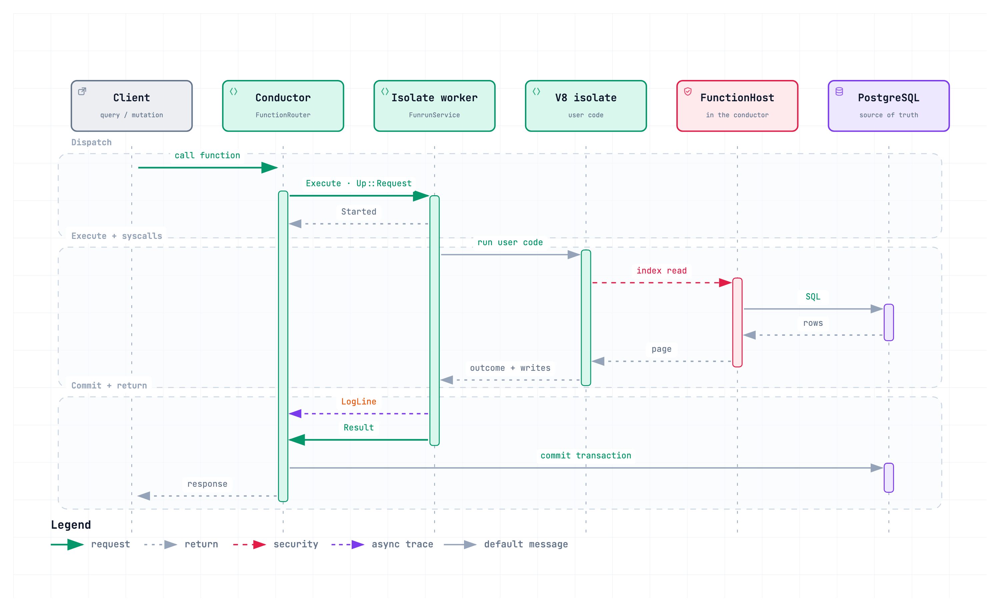
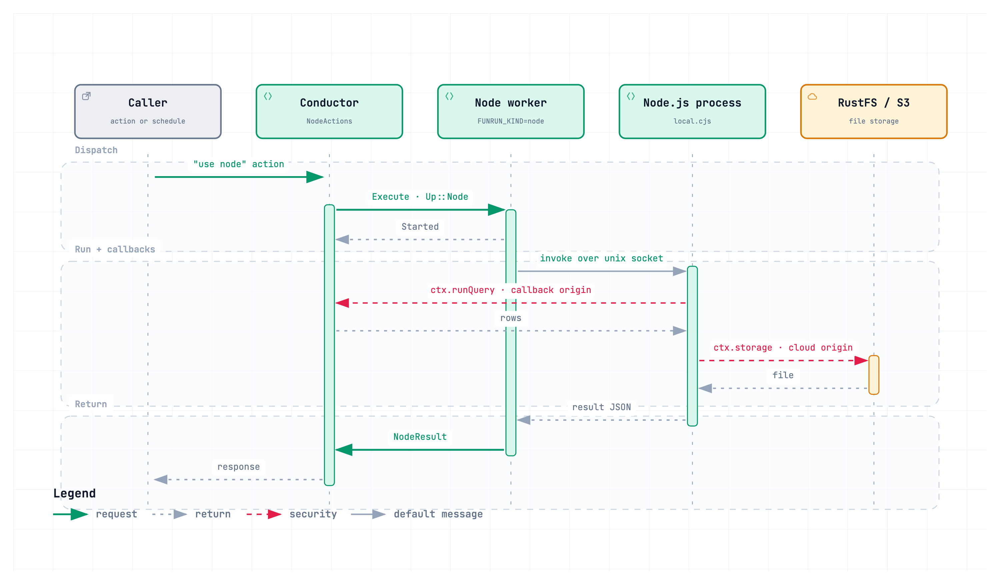

<p align="center">
<picture>
  <source media="(prefers-color-scheme: dark)" srcset="https://static.convex.dev/logo/convex-logo-light.svg" width="600">
  <source media="(prefers-color-scheme: light)" srcset="https://static.convex.dev/logo/convex-logo.svg" width="600">
  
</picture>
</p>

[Convex](https://convex.dev) is the open-source reactive database designed to
make life easy for web app developers, whether human or LLM. Fetch data and
perform business logic with strong consistency by writing pure TypeScript.

Convex provides a database, a place to write your server functions, and client
libraries. It makes it easy to build and scale dynamic live-updating apps.
[Read the docs to learn more](https://docs.convex.dev/understanding/).

Development of the Convex backend is led by the Convex team. We
[welcome small bug fixes](./CONTRIBUTING.md) and
[love receiving feedback](https://discord.gg/convex). We keep this repository
synced with any internal development work within a handful of days. Convex is a
well tested piece of software, with several well designed test frameworks
including randomized testing. Those tests are not provided as part of the open
source offering.

## Getting Started

Visit our [documentation](https://docs.convex.dev/) to learn more about Convex
and follow our getting started guides.

The easiest way to build with Convex is through our
[cloud platform](https://www.convex.dev/plans), which includes a generous free
tier and lets you focus on building your application without worrying about
infrastructure. Many small applications and side-projects can operate entirely
on the free tier with zero cost and zero maintenance.

## Self Hosting

The self-hosted product includes most features of the cloud product, including
the dashboard and CLI. Self-hosted Convex works well with a variety of tools
including Neon, Fly.io, Vercel, Netlify, RDS, Sqlite, Postgres, and more.

You can either use Docker (recommended) or a prebuilt binary to self host
Convex. Check out our [self-hosting guide](./self-hosted/README.md) for detailed
instructions. Community support for self-hosting is available in the
`#self-hosted` channel on [Discord](https://discord.gg/convex).

## Scaled self-hosting: remote function runner

This fork can run Convex functions on a pool of stateless worker processes
instead of inside the backend. The backend becomes the **conductor**: it keeps
the sync engine, the lease, OCC, commits and every index read, exactly as
upstream. Function execution moves out of the process — queries, mutations,
actions, deploy-time evaluation and `"use node"` actions — so V8 and Node scale
horizontally while the core of Convex stays unchanged. `FUNCTION_RUNNER=local`
(the default) keeps the upstream in-process behaviour, byte for byte.



- **Conductor** (`crates/local_backend`): upstream `local_backend`, plus the
  `RemoteFunctionRunner` (`crates/remote_function_runner`), which picks a worker
  by module affinity and reported load, and retries safely. It also runs the
  `FunctionHost` gRPC service (`crates/function_host`) that workers call back
  for index pages, text search and action callbacks.
- **Isolate workers** (`crates/funrun_worker`, `FUNRUN_KIND=isolate`): run
  upstream's `FunctionRunnerCore` in V8, including deploy-time `analyze` and
  schema evaluation. They hold no state; modules and files come from S3 (RustFS
  in the Compose stack). Workers are found by DNS (`FUNRUN_ROUTING=direct`) or
  behind one Envoy address (`FUNRUN_ROUTING=proxy`).
- **Node workers** (`FUNRUN_KIND=node`): an opt-in second pool behind
  `FUNRUN_NODE_WORKERS`, running `"use node"` actions in real Node.js processes
  for npm packages and node builtins. Unset, those actions stay on the conductor
  exactly as upstream.
- **Wire protocol** (`crates/pb_funrun`, `crates/funrun_proto`): one
  bidirectional `Execute` stream per attempt, carrying `Run`, `Deploy` and
  `Node` frames. Bearer tokens are derived from `INSTANCE_SECRET`, one per
  direction, and the protocol version is checked both ways.

### How a call reaches a worker



`pick()` hashes the module path (rendezvous hashing), so one module tends to
reuse one worker's warm isolate, spilling elsewhere when that worker is full or
measurably busier. Health and load arrive on a background stream, never on the
request path. With no healthy worker, `FUNRUN_FALLBACK` chooses between failing
the call and running it in-process.

Retries are keyed on the kind of work, not the connection. Before the worker
sends `Started`, nothing has run, so anything may be re-sent. After `Started`,
only pure work — queries, mutations, deploy evaluation — may be retried; an
action never runs twice. A worker that refuses a request was overloaded before
user code ran, so the conductor backs off (50ms → 2s, jittered) within a
per-kind budget: 30s for actions, whose failure would strand a committed run, 1s
for user-facing reads.

### How a query or mutation runs



1. The conductor picks a read timestamp and sends a `RunRequest` to a worker
   over an `Execute` stream.
2. The worker runs the function in V8. Every index read goes back to the
   conductor's `FunctionHost` as an `IndexPage` at that timestamp. Pages are cut
   at a byte budget and refilled by the worker, so the read set records exactly
   what was read.
3. The worker returns the writes and the read set, and the conductor commits
   them with upstream's OCC check. A conflict retries the mutation, just as in
   process.

### How a `"use node"` action runs



The node worker invokes a Node.js child over a unix socket. Syscalls such as
`ctx.runQuery` return to the conductor through `FUNRUN_NODE_CALLBACK_ORIGIN` —
not through `FunctionHost`, which serves the isolate path only — while
`ctx.storage` URLs are built from `CONVEX_CLOUD_ORIGIN` and fetched by the
action itself. Both origins must resolve from the worker, so a loopback address
that works on the conductor will fail here; the conductor warns about that at
startup.

### Try it

```sh
cd self-hosted/funrun
export INSTANCE_SECRET=$(openssl rand -hex 32)
docker compose up -d --build --scale worker=2
docker compose exec conductor ./generate_admin_key.sh   # dashboard login
open http://127.0.0.1:6791                              # dashboard
```

See [`self-hosted/funrun/README.md`](self-hosted/funrun/README.md) for
configuration, the local-vs-remote e2e suite, failure tests and benchmarks. The
diagrams are generated with [archify](https://github.com/tt-a1i/archify) from
`self-hosted/funrun/docs/*.json`.

## Community & Support

- Join our [Discord community](https://discord.gg/convex) for help and
  discussions.
- Report issues when building and using the open source Convex backend through
  [GitHub Issues](https://github.com/get-convex/convex-backend/issues)
- By submitting pull requests, you confirm that Convex can use, modify, copy,
  and redistribute the contribution, under the terms of its choice.

## Building from source

See [BUILD.md](./BUILD.md).

## Disclaimers

- If you choose to self-host, we recommend following the self-hosting guide. If
  you are instead building from source, make sure to change your instance secret
  and admin key from the defaults in the repo.
- Convex is battle tested most thoroughly on Linux and Mac. On Windows, it has
  less experience. If you run into issues, please message us on
  [Discord](https://convex.dev/community) in the `#self-hosted` channel.
- Convex self-hosted builds contain a beacon to help Convex improve the product.
  The information is minimal and anonymous and helpful to Convex, but if you
  really want to disable it, you can set the `--disable-beacon` flag on the
  backend binary. The beacon's messages print in the log and only include
  - A random identifier for your deployment (not used elsewhere)
  - Migration version of your database
  - Git rev of the backend
  - Uptime of the backend

## Repository layout

- `crates/` contains Rust code

  - Main binary
    - `local_backend/` is an application server on top of the `Runtime`. This is
      the serving edge for the Convex cloud.

- `npm-packages/` contains both our public and internal TypeScript packages.
  - Internal packages
    - `udf-runtime/` sets up the user-defined functions JS environment for
      queries and mutations
    - `system-udfs/` contains functions used by the Convex system e.g. the CLI
